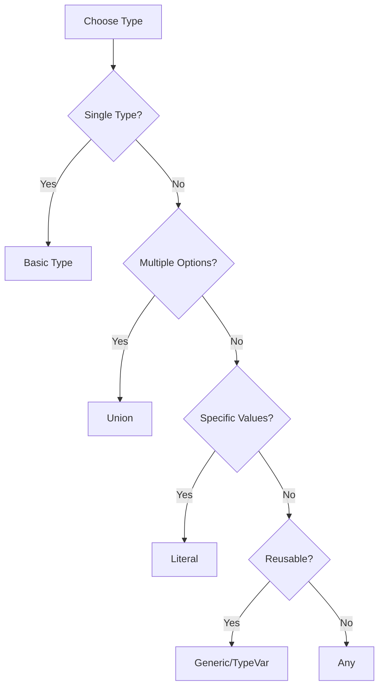

# 🐍 Python Typing Mastery Tutorial

> **A comprehensive guide to Python's typing system with Pydantic integration and LangChain applications**

[](https://python.org)
[](https://pydantic.dev)
[](https://langchain.com)
[](LICENSE)

## 📋 Table of Contents

- [🎯 Overview](#-overview)
- [🚀 Quick Start](#-quick-start)
- [📖 Learning Modules](#-learning-modules)
- [🛠️ Prerequisites](#️-prerequisites)
- [💡 Key Concepts](#-key-concepts)
- [🔧 Installation](#-installation)
- [📚 Usage Examples](#-usage-examples)
- [🌟 Advanced Features](#-advanced-features)
- [🔗 Integration Examples](#-integration-examples)
- [📈 Learning Path](#-learning-path)
- [🤝 Contributing](#-contributing)

## 🎯 Overview

This tutorial provides a hands-on approach to mastering Python's typing system, from basic type hints to advanced generic programming. Perfect for developers working with **Pydantic**, **LangChain**, and **LangGraph** who want to write type-safe, maintainable code.

### ✨ What You'll Learn

- 🔹 **Basic Types**: `List`, `Dict`, `Tuple`, `Optional`
- 🔹 **Advanced Types**: `Union`, `Literal`, `Annotated`
- 🔹 **Structural Typing**: `TypedDict`, `Callable`
- 🔹 **Generic Programming**: `TypeVar`, `Generic`, `Any`
- 🔹 **Pydantic Integration**: Model validation and constraints
- 🔹 **LangChain Tools**: Type-safe agent development

## 🚀 Quick Start

```bash
# Clone the repository
git clone <repository-url>
cd python-typing-tutorial

# Install dependencies
pip install pydantic langgraph langchain-core

# Run the tutorial
python typing_tutorial.py
```

## 📖 Learning Modules

### Module 1: 🔤 Basic Types
Learn the foundation of Python typing with essential types that form the building blocks of type-safe code.

```python
# Lists with type hints
numbers: List[int] = [1, 2, 3, 4, 5]
names: List[str] = ["Alice", "Bob", "Charlie"]

# Dictionaries with key-value types
user_data: Dict[str, int] = {"age": 25, "score": 95}

# Tuples with fixed structure
coordinates: Tuple[float, float] = (78.4, 21.2)

# Optional values (can be None)
optional_name: Optional[str] = None
```

### Module 2: 🔀 Union & Literal Types
Handle multiple possible types and restrict values to specific options.

```python
# Accept multiple types
payment_amount: Union[int, float, str] = "1500"

# Restrict to specific values
order_status: Literal["pending", "completed", "cancelled"] = "pending"
```

### Module 3: 📋 TypedDict & Callable
Structure dictionaries without classes and type function parameters.

```python
class UserProfile(TypedDict):
    name: str
    email: str
    age: int

# Function type specification
discount_func: Callable[[float, float], float]
```

### Module 4: 🧬 Generic Programming
Create reusable, type-safe containers and functions.

```python
T = TypeVar('T')

class Container(Generic[T]):
    def __init__(self, item: T):
        self.item = item
    
    def get_item(self) -> T:
        return self.item

# Usage
int_container = Container[int](42)
str_container = Container[str]("Hello")
```

## 🛠️ Prerequisites

- **Python 3.8+** (Type hints support)
- **Basic Python knowledge** (Classes, functions, data structures)
- **Package management** (pip/conda)

## 💡 Key Concepts

### 🎯 Type Safety Benefits

| Feature | Without Typing | With Typing |
|---------|----------------|-------------|
| **Error Detection** | Runtime errors | Compile-time warnings |
| **IDE Support** | Limited autocomplete | Full IntelliSense |
| **Documentation** | Manual docs | Self-documenting code |
| **Refactoring** | Risky changes | Safe transformations |

### 🔍 When to Use Each Type



## 🔧 Installation

### Core Dependencies

```bash
pip install pydantic>=2.0
pip install langgraph
pip install langchain-core
```

### Development Dependencies

```bash
pip install mypy          # Type checking
pip install black         # Code formatting
pip install isort         # Import sorting
```

## 📚 Usage Examples

### 🏗️ Pydantic Model with Advanced Typing

```python
from pydantic import BaseModel, Field
from typing import List, Dict, Optional, Annotated

class User(BaseModel):
    name: str
    email: str
    tags: List[str] = []
    metadata: Dict[str, Any] = {}
    age: Annotated[int, Field(gt=0, le=120)]
    address: Optional[str] = None
    
    class Config:
        validate_assignment = True

# Usage
user = User(
    name="John Doe",
    email="john@example.com",
    age=30,
    tags=["developer", "python"]
)
```

### 🛠️ LangChain Tool with Typing

```python
from langchain_core.tools import tool
from pydantic import BaseModel, Field

class CalculatorInput(BaseModel):
    a: float = Field(description="First number")
    b: float = Field(description="Second number")
    operation: Literal["+", "-", "*", "/"] = Field(description="Operation")

@tool
def calculator(a: float, b: float, operation: str) -> float:
    """Perform basic arithmetic operations."""
    operations = {"+": a + b, "-": a - b, "*": a * b, "/": a / b}
    return operations[operation]
```

### 🔄 LangGraph State with TypedDict

```python
from langgraph.graph import StateGraph
from langgraph.graph.message import add_messages
from typing import TypedDict, Annotated, List

class AgentState(TypedDict):
    messages: Annotated[List[dict], add_messages]
    user_input: str
    context: Dict[str, Any]
    summary: Optional[str]

# Create graph with typed state
graph = StateGraph(AgentState)
```

## 🌟 Advanced Features

### 🧪 Generic Container Classes

```python
from typing import TypeVar, Generic, Protocol

T = TypeVar('T')
K = TypeVar('K')
V = TypeVar('V')

class Repository(Generic[T]):
    """Generic repository pattern."""
    
    def __init__(self):
        self._items: List[T] = []
    
    def add(self, item: T) -> None:
        self._items.append(item)
    
    def get_all(self) -> List[T]:
        return self._items.copy()

# Usage
user_repo = Repository[User]()
product_repo = Repository[Product]()
```

### 🎭 Protocol-Based Typing

```python
from typing import Protocol

class Drawable(Protocol):
    def draw(self) -> str: ...

class Circle:
    def draw(self) -> str:
        return "Drawing a circle"

class Square:
    def draw(self) -> str:
        return "Drawing a square"

def render_shape(shape: Drawable) -> str:
    return shape.draw()
```

## 🔗 Integration Examples

### 🤖 Complete Agent Example

```python
from langgraph.graph import StateGraph, END
from langchain_core.tools import tool
from typing import TypedDict, Annotated, List, Literal

# State definition
class AgentState(TypedDict):
    messages: Annotated[List[dict], add_messages]
    current_step: Literal["input", "processing", "output"]
    result: Optional[str]

# Tool definition
@tool
def process_query(query: str) -> str:
    """Process user query and return result."""
    return f"Processed: {query}"

# Node functions
def input_node(state: AgentState) -> AgentState:
    return {"current_step": "processing"}

def process_node(state: AgentState) -> AgentState:
    # Processing logic here
    return {"current_step": "output", "result": "Success"}

# Build graph
graph = StateGraph(AgentState)
graph.add_node("input", input_node)
graph.add_node("process", process_node)
graph.add_edge("input", "process")
graph.add_edge("process", END)
```

## 📈 Learning Path

### 🎯 Beginner Track
1. **Basic Types** → Start with `List`, `Dict`, `Tuple`
2. **Optional Values** → Handle `None` cases safely
3. **Pydantic Basics** → Create validated models

### 🚀 Intermediate Track
4. **Union Types** → Handle multiple type possibilities
5. **Literal Types** → Restrict to specific values
6. **TypedDict** → Structure without classes

### 🧠 Advanced Track
7. **Generic Programming** → Create reusable components
8. **Protocol Typing** → Define interfaces
9. **LangChain Integration** → Build typed agents

## 🎨 Best Practices

### ✅ Do's

```python
# ✅ Use specific types
def process_users(users: List[User]) -> Dict[str, int]:
    return {user.name: user.age for user in users}

# ✅ Use Optional for nullable values
def find_user(user_id: int) -> Optional[User]:
    return database.get_user(user_id)

# ✅ Use Literal for restricted choices
def set_status(status: Literal["active", "inactive"]) -> None:
    self.status = status
```

### ❌ Don'ts

```python
# ❌ Avoid Any unless absolutely necessary
def process_data(data: Any) -> Any:
    return data

# ❌ Don't ignore type errors
def unsafe_function(items):  # Missing type hints
    return items[0].some_method()

# ❌ Don't use bare except with typed functions
def risky_function(data: List[str]) -> str:
    try:
        return data[0]
    except:  # Too broad exception handling
        return ""
```

## 🧪 Testing Your Knowledge

### Quick Quiz

1. **What's the difference between `List[str]` and `list`?**
2. **When should you use `Union` vs `Optional`?**
3. **How do `TypeVar` and `Generic` work together?**
4. **What are the benefits of using `TypedDict` over regular dictionaries?**

### Practice Exercises

```python
# Exercise 1: Create a generic Stack class
# Exercise 2: Build a typed API response model
# Exercise 3: Design a LangChain tool with complex inputs
```

## 🔧 Troubleshooting

### Common Issues

| Problem | Solution |
|---------|----------|
| **Import errors** | `pip install typing_extensions` for older Python |
| **MyPy complaints** | Add `# type: ignore` for unavoidable issues |
| **Pydantic validation** | Check field types and constraints |
| **Generic confusion** | Start simple, add complexity gradually |

## 🤝 Contributing

We welcome contributions! Please see our [Contributing Guide](CONTRIBUTING.md) for details.

### Areas for Contribution
- 📝 **Documentation** improvements
- 🧪 **Example code** additions
- 🐛 **Bug fixes** and improvements
- 🌟 **New features** and tutorials

## 📜 License

This project is licensed under the MIT License - see the [LICENSE](LICENSE) file for details.

## 🙏 Acknowledgments

- **Python Core Team** for excellent typing support
- **Pydantic Team** for making validation elegant
- **LangChain Community** for inspiring real-world applications

---

<div align="center">

**Happy Typing! 🎉**

[⭐ Star this repo](.) | [🐛 Report Bug](issues) | [💡 Request Feature](issues)

Made with ❤️ by the Python Community

</div>